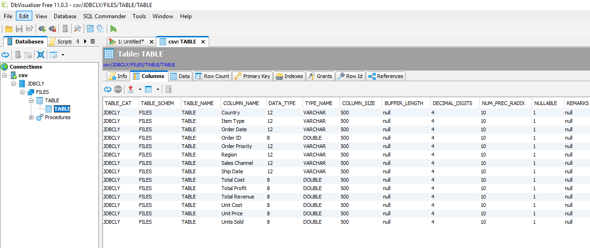
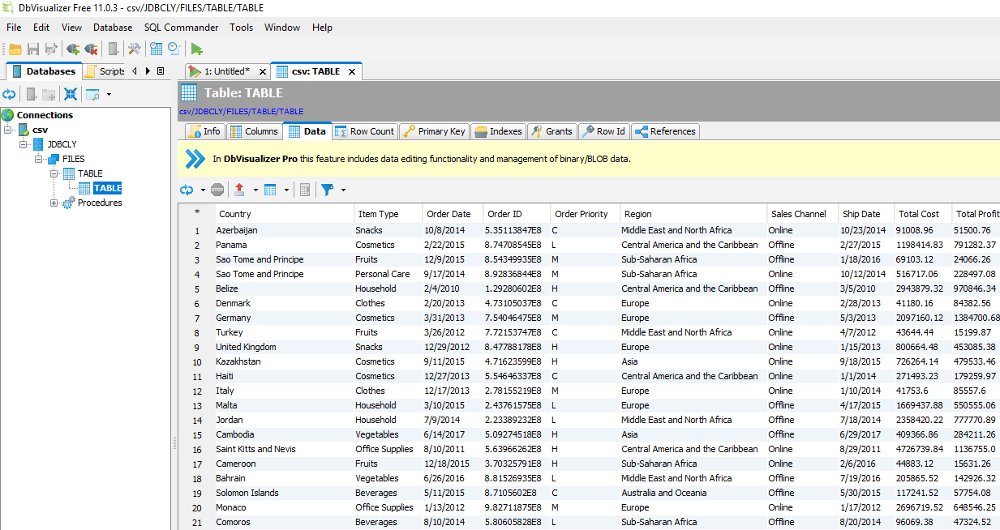

# JDBCLY: A simple JDBC driver for reading CSV files.

> JDBC, DRIVER, CSV, FILE, FILES

JDBCLY is a simple lightweight driver which allows reading CSV files through a Java JDBC interface.

To use it, simply specify a connection string of the format:
```
jdbcly-csv://{your_file_path}
```
The driver will then expose a table named "TABLE", which can be used to query the dataset.

> <b>Notice</b>: <br>
> This project serves for <b>educational</b> purposes only.
> The project started as a learning opportunity, and provides limited support for standard JDBC features.

## Table of Contents
- [Tools](#tools)
- [Example](#example)
- [Features](#features)
- [Documentation](#documentation)
- [FAQ](#faq)
- [TODO](#todo)
- [License](#license)

---

## Tools

The driver can be used with various tools, although it might not work with all of them - depending on the requested functionality .

Here is a preview using DBVisualizer Free:





## Example

```java
import java.sql.*;

public class Main {

    public static void main(String[] args) throws Exception {
        Class.forName("com.jdbcly.jdbc.JdbclyDriver");

        Connection connection = DriverManager.getConnection("jdbcly-csv://C:/Path/To/File/file_name.csv?delimiter=,;scandepth=0");

        System.out.println("Rows");
        Statement statement = connection.createStatement();
        ResultSet rs = statement.executeQuery("SELECT country, `units sold` FROM table where `units sold` < 934 and country = 'United Kingdom' order by `units sold` desc limit 20");
        while (rs.next()) {
            for (int i = 1; i <= rs.getMetaData().getColumnCount(); i++) {
                System.out.println(rs.getMetaData().getColumnName(i) + ":" + rs.getObject(i));
            }
            System.out.println();
        }
    }
}
```

---

## Features
- Read from CSV files
- Support for VARCHAR (String) and DOUBLE data types.
- Data type is determined automatically.
- The following SQL features are partially supported (formula support is missing):
    - Columns projection (select which columns to retrieve)
    - Order By (sort on column values)
    - Where (filter on column values)
    - Limit
    - Offset
    
## Documentation
- General
    - This is a read-only driver
    - Pagination is not supported - the whole dataset will be read in memory before being returned

- CSV
    - Available connection properties
        - delimiter - specify which delimiter to use (default: ',')
        - scandepth - specify the number of rows to scan in order to determine the column data types (default: 10)
    - Info
        - CSV parsing is based on OpenCSV
## FAQ  
- **Why does the driver not work properly when using [insert tool name]?**
    - This driver supports limited functionality. Whether the driver will work correctly with a specific tool depends on the specific functionality the tool is attempting to use.
    
    
## TODO
- Add tests
- Add support for more data types
- Add support for more source formats (json, xml)
---
## License

[](https://opensource.org/licenses/Apache-2.0)

- **[Apache Software License, Version 2.0](https://www.apache.org/licenses/LICENSE-2.0)**

Copyright 2020 [mjellma @ https://github.com/mjellma]

Licensed under the Apache License, Version 2.0 (the "License");
you may not use this file except in compliance with the License.
You may obtain a copy of the License at

    http://www.apache.org/licenses/LICENSE-2.0

Unless required by applicable law or agreed to in writing, software
distributed under the License is distributed on an "AS IS" BASIS,
WITHOUT WARRANTIES OR CONDITIONS OF ANY KIND, either express or implied.
See the License for the specific language governing permissions and
limitations under the License.